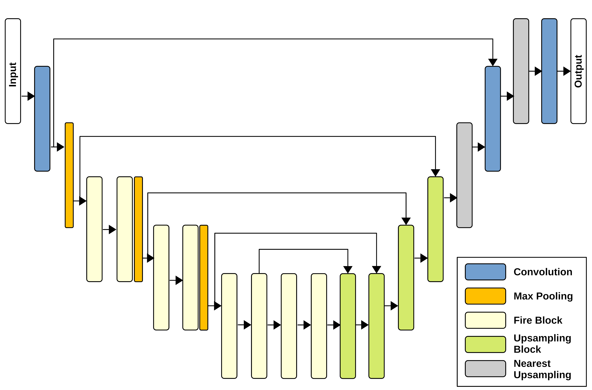
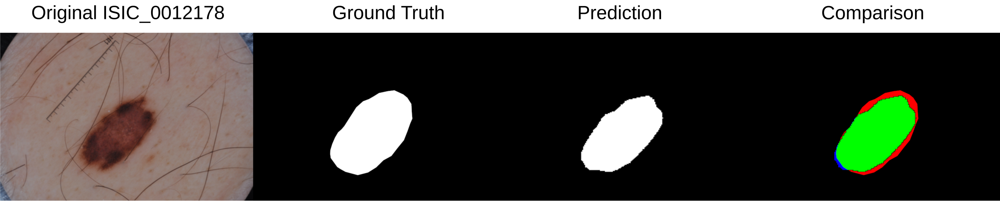

# Attention Squeeze U-Net

Attention Squeeze U-Net is a network for Skin Lesion Segmentation able to run on embedded devices.

The network is made as shown in the following image:



The network has been trained on 

## Requirements

* Numpy
* Tensorflow (>= 2.0)
* Pillow
* OpenCV (>= 4.0)

## Usage

You can download isic2017 from this [link](https://challenge.isic-archive.com/landing/2017). 
If you want to use your own dataset, the training, validation, and testing folder have to contain the the images in _jpg_ format and the masks in _png_ format.

### Training

```bash
python train.py --train_set /path/to/isic2017 --eval_set /path/to/validation/isic2017 --checkpoint_dir /path/to/directory/where/you/want/to/save/the/models --aug_scale 3 --network attention_squeeze_unet (or squeeze_unet, attention_unet, unet, segnet)
``` 

### Testing

```bash
python test.py --test_dir /path/to/testing/isic2017 --resume /path/to/the/trained/model --network attention_squeeze_unet (or squeeze_unet, attention_unet, unet, segnet)
```

### Inference

```bash
python test.py --test_dir /path/to/testing/isic2017 --resume /path/to/the/trained/model --save_dir /path/to/the/directory/to/save/masks --network attention_squeeze_unet (or squeeze_unet, attention_unet, unet, segnet)
```

## Output Example

Attention Squeeze U-Net has only 2.6 millions of parameters to train. The output of the inference proces is as follows:



## More Info

```
@article{Pennisi2022SkinLA,
  title={Skin Lesion Area Segmentation Using Attention Squeeze U-Net for Embedded Devices},
  author={Andrea Pennisi and Domenico Daniele Bloisi and Vincenzo Suriani and Daniele Nardi and Antonio Facchiano and Annalisa Giampetruzzi},
  journal={Journal of Digital Imaging},
  year={2022},
  volume={35},
  pages={1217 - 1230}
}
```
